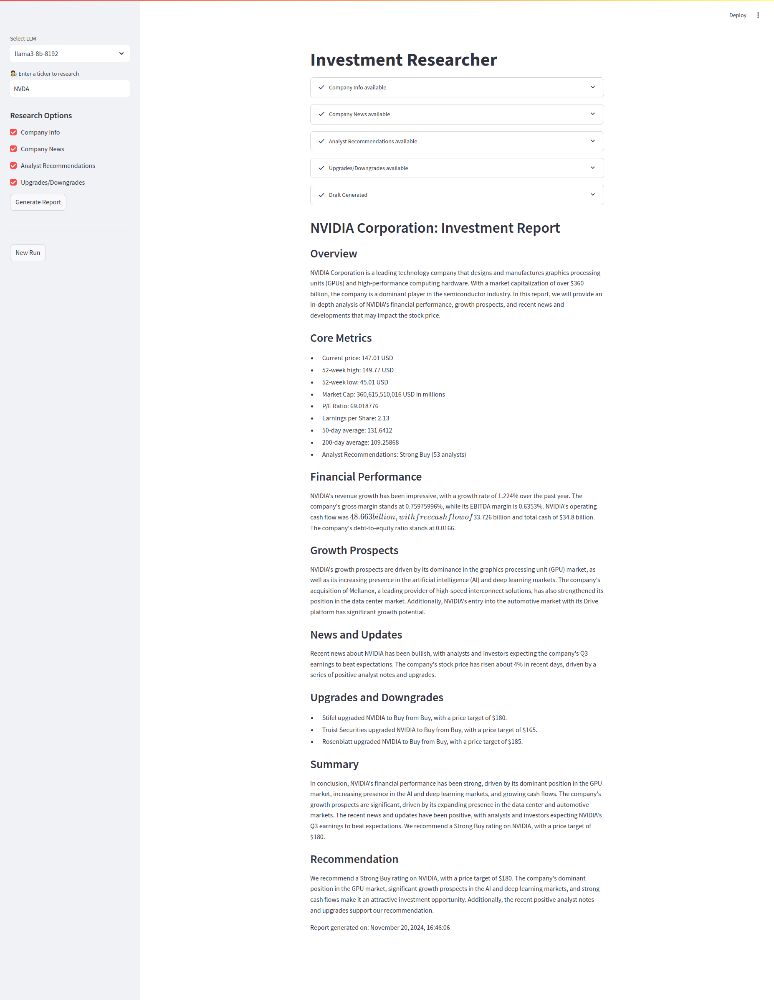

# Investment Researcher

Welcome to the **Investment Researcher** application! This app provides in-depth research and analysis for a specific stock ticker. By leveraging advanced language models, financial APIs, and news search integrations, it generates professional-grade investment reports.



## Features

- **Ticker Research**: Input a stock ticker (e.g., `NVDA`) to analyze.
- **Company Information**: View essential details about the company, such as sector, market cap, EPS, and more.
- **Latest News**: Fetch and display recent news articles related to the company.
- **Analyst Recommendations**: Review the most recent recommendations from analysts.
- **Upgrades/Downgrades**: Explore upgrades and downgrades for the stock by financial firms.
- **Final Report Generation**: Create a comprehensive investment report tailored for professional use.

---

## Technology Stack

- **Streamlit**: Interactive UI for the application.
- **YFinance**: Fetch financial data and company details.
- **DuckDuckGo Search API**: Retrieve recent news articles about the company.
- **LLM Integration**: Leverages advanced models (e.g., `llama3`, `Groq`) for report drafting.
- **Python**: Backend programming language.

---

## How to Run the Application

### Prerequisites

1. **Python 3.9 or above**: Ensure Python is installed.
2. **Install dependencies**: Use `pip` to install required libraries.

### Steps

1. Clone the repository:
   ```bash
   git clone https://github.com/ssvasan369/Investment_Strategist.git
   cd investment-researcher
